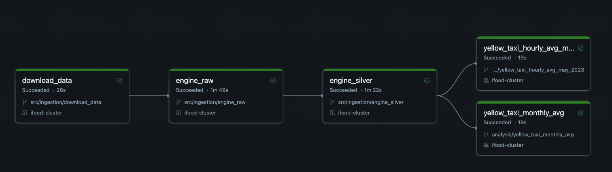
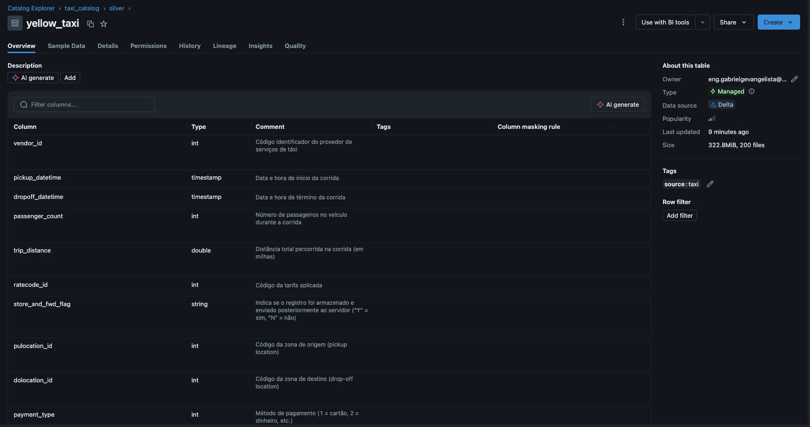

# Análise de dados de táxis de Nova York

Este projeto implementa uma solução de engenharia de dados para análise das corridas de táxis amarelos (yellow taxis) de Nova York, utilizando dados oficiais da NYC Taxi & Limousine Commission (TLC).

## Arquitetura da solução

A solução foi implementada utilizando uma arquitetura de dados em camadas no Databricks:

1. **Landing Zone** (`/Volumes/taxi_catalog/landing/yellow_taxi/`)
   - Armazenamento dos arquivos Parquet originais
   - Dados brutos baixados diretamente da fonte oficial

2. **Bronze** (`taxi_catalog.bronze.yellow_taxi`)
   - Dados brutos mantidos o mais próximo possível do formato original
   - Adição apenas de metadados de rastreabilidade (arquivo fonte e timestamp)
   - Conversões mínimas de tipos de dados para evitar conflitos (ex: VendorID para long)

3. **Silver** (`taxi_catalog.silver.yellow_taxi`)
   - Dados limpos e estruturados
   - Padronização de nomes de colunas
   - Particionamento por ano/mês/dia
   - Transformações de tipos de dados
   - Documentação completa de todas as colunas com descrições detalhadas

4. **Gold** (`taxi_catalog.gold.*`)
   - Agregações e métricas para análise
   - Tabelas específicas para cada tipo de análise

## Pipeline de Dados

O pipeline de dados é executado através de um workflow automatizado que coordena a execução dos notebooks em sequência:



## Estrutura do projeto

```
dl_ny_taxis/
├─ src/
│  └─ ingestion/           # Scripts de ingestão de dados
│     ├─ download_data.ipynb    # Download dos dados brutos
│     ├─ engine_raw.ipynb      # Ingestão na camada bronze
│     └─ engine_silver.ipynb   # Transformação para camada silver
├─ analysis/              # Notebooks de análise
│  ├─ yellow_taxi_monthly_avg.ipynb        # Média mensal de valores
│  └─ yellow_taxi_hourly_avg_may_2023.ipynb # Média horária de passageiros
├─ workflows/            # Configurações de workflows
│  └─ pipeline.yml       # Definição do pipeline de dados
└─ README.md
```

## Pré-requisitos

- Acesso ao Databricks Community Edition
- Runtime Databricks 11.x ou superior (DBR 11.x+)
- Configuração de Volume Databricks para armazenamento dos dados

## Execução

### 1. Configuração inicial

1. Importe os notebooks para seu workspace Databricks
2. Configure um cluster com DBR 11.x ou superior
3. Configure o Volume Databricks em `/Volumes/taxi_catalog/`

### 2. Pipeline de dados

O pipeline é executado automaticamente através do workflow definido em `workflows/pipeline.yml`. Os notebooks são executados na seguinte ordem:

1. **Download dos dados** (`src/ingestion/download_data.ipynb`)
   - Baixa os dados de Janeiro a Maio de 2023
   - Salva na landing zone em formato Parquet

2. **Ingestão Bronze** (`src/ingestion/engine_raw.ipynb`)
   - Ingere os dados brutos
   - Adiciona metadados
   - Cria tabela Delta Lake na camada bronze

3. **Processamento Silver** (`src/ingestion/engine_silver.ipynb`)
   - Limpa e estrutura os dados
   - Padroniza formatos
   - Cria tabela Delta Lake particionada na camada silver

### 3. Análises disponíveis

1. **Média Mensal de Valores** (`analysis/yellow_taxi_monthly_avg.ipynb`)
   - Calcula a média do valor total (total_amount) por mês
   - Período: Janeiro a Maio de 2023
   - Resultado na tabela: `taxi_catalog.gold.yellow_taxi_monthly_avg`

2. **Média horária de passageiros** (`analysis/yellow_taxi_hourly_avg_may_2023.ipynb`)
   - Calcula a média de passageiros por hora do dia
   - Período: Maio de 2023
   - Resultado na tabela: `taxi_catalog.gold.yellow_taxi_hourly_avg_may_2023`

## Estrutura dos dados

A documentação detalhada dos campos está disponível na tabela `taxi_catalog.silver.yellow_taxi`. Todas as colunas possuem descrições completas que explicam seu significado e uso, como pode ser visto na imagem abaixo:



## Fonte dos dados

Os dados são obtidos do site oficial da NYC TLC:
https://www.nyc.gov/site/tlc/about/tlc-trip-record-data.page